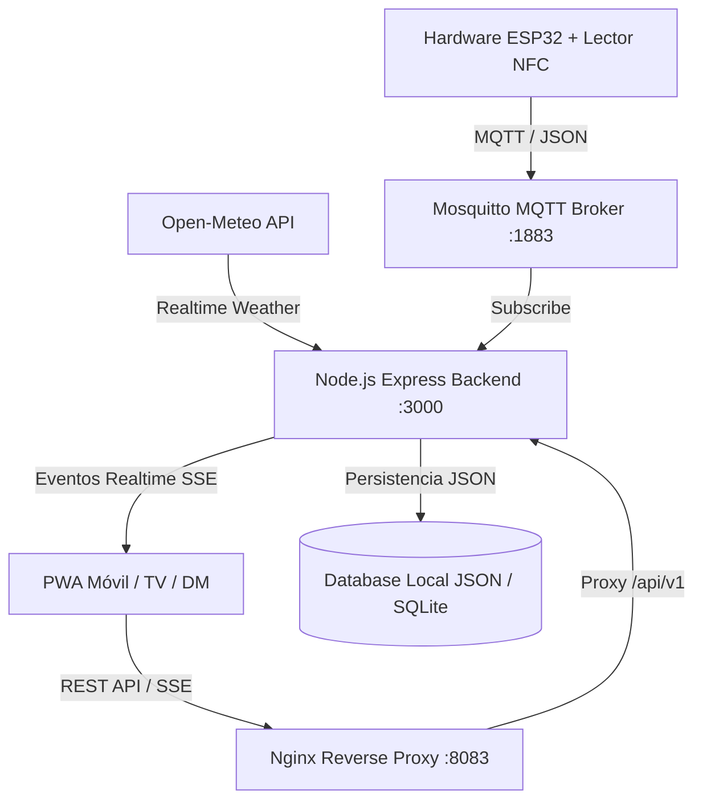

# 📜 GUÍA COMPLETA Y ARQUITECTURA DE JUEGO: "EL GREMIO DE LA TABERNA" (NFC RPG)

---

## 🎲 1. CONCEPTO GENERAL Y VISIÓN DEL PROYECTO

**El Gremio de la Taberna** es un sistema RPG de asistencia gamificada por hardware NFC y PWA diseñado para operar **24/7** en un entorno físico y remoto para grupos de amigos.

Los jugadores poseen un **llavero físico o tarjeta NFC** para su visita presencial y una **PWA Móvil** para gestionar su personaje, reclamar su Medalla Diaria de mantenimiento y desafiar a sus rivales a Duelos PvP.

---

## 🏗️ 2. ARQUITECTURA DE SOFTWARE E INFRAESTRUCTURA

El sistema está construido en una arquitectura orientada a eventos y microservicios encapsulados en **Docker**:

### Componentes Clave:
1. **Backend (Node.js + Express + TypeScript)**:
   - **Base de Datos Persistente (`db.ts`)**: Motor JSON autónomo con soporte para Rachas Diarias, Estadísticas PvP, Títulos de Rango e Ítems Malditos.
   - **Motor RPG & Duelos (`rpgEngine.ts`)**: Procesa tiradas de dados, duelos PvP Bo3 con pasivas de clase, ítems malditos y duelos rápidos en barra.
   - **Servicio Meteorológico (`weatherService.ts`)**: Consulta la API gratuita de **Open-Meteo** para aplicar bonificadores por clima adverso (lluvia, tormenta, noche, frío/calor extremo).
   - **Servicio SSE (`sseHub.ts`)**: Emite al instante las animaciones de dados y duelos PvP a las pantallas conectadas.

2. **Frontend (React 18 + Vite + TailwindCSS)**:
   - **PWA Móvil (Jugador)**: Incluye reclamación de Medalla Diaria Móvil, lanzador de duelos asíncronos PvP y mochila con consumibles malditos.
   - **Modo TV (Pantalla Pública 24/7)**: Renderizado dinámico de efectos de clima real, ranking top 5 compacto y arena de duelos PvP Bo3 en pantalla gigante.

---

## ⚔️ 3. SISTEMA Y ESTILO DE JUEGO (MECÁNICAS RPG)

### 3.1. Progresión en Dos Capas (Móvil vs Presencial)
Para mantener la progresión fluida sin obligar a desplazamientos diarios forzados:

1. **Medalla Diaria Móvil (Check-in Remoto PWA)**:
   - Se reclama **1 vez cada 24 horas** desde el teléfono móvil con 1 toque.
   - Otorga: **+15 XP**, **+5 Oro** y mantiene/incrementa la **Racha Diaria ($\text{streak\_days}$)**.
2. **Tirada de Taberna NFC (Presencial en Hardware)**:
   - Otorga el botín completo ($1d20$ base + pasivas + clima + multiplicadores).
   - Activa duelos rápidos presenciales en barra si 2 aventureros escanean con menos de 15 segundos de diferencia.

---

### 3.2. Sistema de Duelos de Taberna (PvP Bo3)
Arena de combate al Mejor de 3 Tiradas (Bo3) con compensación de nivel acotada:

$$\text{Puntaje de Ronda} = 1d20 + \lfloor \frac{\text{Nivel}}{5} \rfloor + \text{Modificador de Clase}$$

- **Bono de Nivel Acotado**: Cada 5 niveles otorgan +1 plano al dado. Un Nivel 15 suma solo +3 frente a un Nivel 1, permitiendo sorpresas y remontadas.
- **Pasivas de Clase en Duelo**:
  - 🛡️ **Guerrero / Paladín**: Si empata una ronda, gana automáticamente por desempate de armadura.
  - 🗡️ **Pícaro / Asesino**: Si saca $\ge 18$ en una ronda, inflige 2 victorias de ronda en un solo golpe (K.O. Instantáneo).
  - 🔮 **Mago / Nigromante**: Si pierde la 1ª ronda, suma $+4$ a la 2ª ronda por sobrecarga arcana.
  - 🎼 **Bardo**: Roba $+50\%$ de oro adicional de la apuesta al ganar.

---

### 3.3. Motor de Clima Real (Open-Meteo API)
El backend ajusta el botín del escaneo presencial consultando el clima local en tiempo real:

| Condición Real | Requisito | Modificador al Escaneo NFC |
| :--- | :--- | :--- |
| 🌧️ **Lluvia / Tormenta** | Precipitación $>0.5\text{ mm/h}$ | **+35 XP y +15 Oro** planos (*Aventurero Inclemente*). |
| 🌙 **Noche de Taberna** | Horario de 21:00 a 04:00 | **+25% de Oro** total acumulable. |
| ❄️ **Frío / Calor Extremo** | Temp $<8^\circ\text{C}$ o $>34^\circ\text{C}$ | Doble progreso en misiones activas. |
| ☀️ **Día Templado** | Clima estándar | Botín estándar. |

---

### 3.4. Catálogo de Artículos Malditos (Tienda del Gremio)
Consumibles de alto riesgo y coste reducido:

- 🩸 **Pacto de Sangre (15 Oro)**: Triplica el Oro obtenido. *Maldición*: Si $d20 \le 6$, pierde 20 XP y queda incapacitado para duelos por 24h.
- 💀 **Dado del Nigromante (20 Oro)**: Tirada de 13 a 19 se considera Nat 20 (25 XP / 25 G). *Maldición*: Si saca par $<10$, otorga 0 XP y 0 Oro.
- 🕯️ **Candelabro de la Desdicha (10 Oro)**: +50 XP fijos. *Maldición*: El próximo aliado en escanear recibe penalización del -30% en su botín.

---

### 3.5. Ranking y Leaderboard Global (Métricas de Desempate)
El Modo TV y la PWA ordenan la clasificación bajo la siguiente jerarquía estricta:
1. **Nivel del Jugador** (Mayor a menor)
2. **XP Total Acumulada**
3. **Días de Racha Activa ($\text{streak\_days}$)**
4. **Winrate en Duelos PvP ($\text{pvp\_wins} / (\text{pvp\_wins} + \text{pvp\_losses})$)**

---

## 📺 4. DESPLIEGUE Y ACCESO A VISTAS

- **PWA Móvil Jugadores**: `http://192.168.0.200:8083`
- **Modo TV Pantalla Pública 24/7**: `http://192.168.0.200:8083` (Hacer clic en *"Ver Pantalla Pública MODO TV"*)
- **Panel DM Modo Dios**: `http://192.168.0.200:8083` (Login: `admin` / `admin123`)
